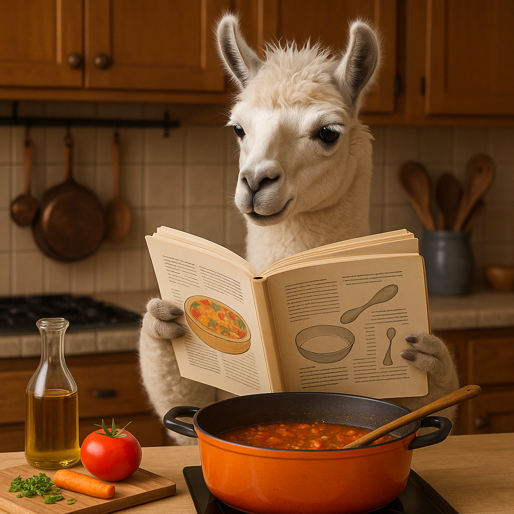
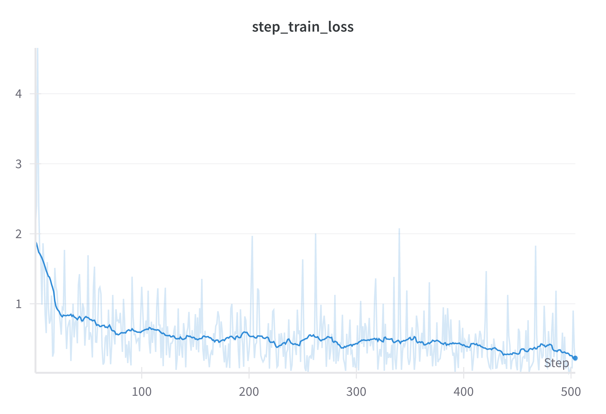
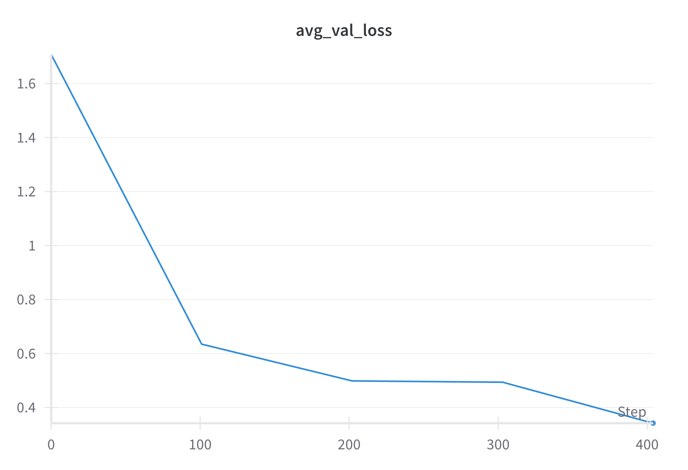

# cooking-llama
##### Fine-tuning Llama-3.2-1B-Instruct on the RecipesNLG dataset

<p align="center">
  
</p>

Following https://cookbook.openai.com/examples/how_to_finetune_chat_models, we fine-tune our own instance of Llama-3.2-1B-Instruct.
Our approach is purely `torch` based. Model weights were obtained from https://www.llama.com/models/llama-3/.
We update these weights to specialise in extracting the generic ingredients from a recipe. That is, we train on input-output pairs that look as follows:
```
Input:
Title: 7 Layer Salad
Ingredients: ["10 to 12 leaves spinach, torn up", "8 to 10 mushrooms, sliced", "Bermuda onion, sliced", "2 boiled eggs, sliced", "4 strips bacon, fried and crumbled", "tomatoes, peeled and chunked", "Ranch dressing"]


Output:
["spinach", "mushrooms", "Bermuda onion", "eggs", "bacon", "tomatoes", "dressing"]
```
See `./train` and `./inference` for training and inference logic, respectively.

| Training Loss | Validation Loss |
|:-------------:|:---------------:|
|  |  |

